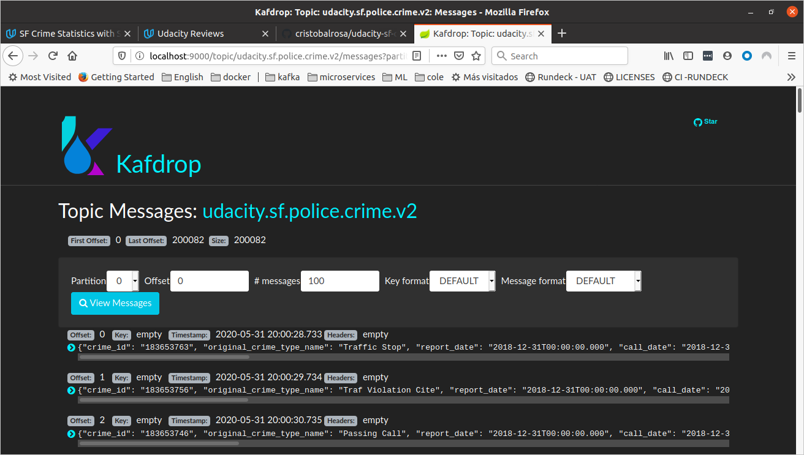
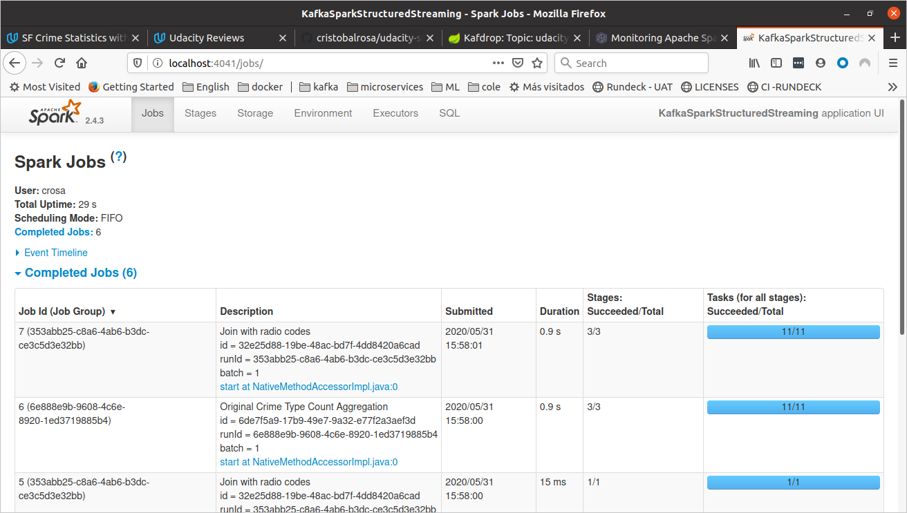

# SF Crime Statistics  with Spark Streaming

## Project Overview

In this project, you will be provided with a real-world dataset, extracted from Kaggle, on San Francisco crime incidents, and you will provide statistical analyses of the data using Apache Spark Structured Streaming. You will draw on the skills and knowledge you've learned in this course to create a Kafka server to produce data, and ingest data through Spark Structured Streaming.

## Development Environment

You may choose to create your project in the workspace we provide here, or if you wish to develop your project locally, you will need to set up your environment properly as described below:

    Spark 2.4.3
    Scala 2.11.x
    Java 1.8.x
    Kafka build with Scala 2.11.x
    Python 3.6.x or 3.7.x
## Project rubric
### Configure Zookeeper/Kafka server correctly. Write Kafka Producer code correctly.
I have used a docker compose environment for this project so I can run it locally. To start the environment just run 
`docker-compose up` on the docker folder. 

I have configured zookeeper to listen in the default port 2181 and then I have set up kafka to use that zookeeper instance
by setting up the environment variable:
```KAFKA_ZOOKEEPER_CONNECT: "zookeeper:2181"```

Kafka is configured to be listening on `localhost:9092` from outside the internal docker network `crosa-labsl-network` and 
on `kafka:29092` from inside the docker network. Since I'm going to run the `kafka_server.py` from my local 
computer and not from  the docker network I will have to configure it to connect to localhost:9092. 

### Create a properly working Apache Kafka server that is producing data. Create a visualization of the data produced by the Kafka server by creating a consumer server

This is an image of the console consumer working on my dev environment (pycharm)


This is an image of the console consumer using the command line


Kafdrop UI showing data on the topic:


### Set up SparkSession in local mode and Spark configurations.

A couple of things here:
```    spark = SparkSession \
        .builder \
        .master("local[*]") \
        .appName("KafkaSparkStructuredStreaming") \
        .config("spark.default.parallelism", "4") \
        .config("spark.sql.shuffle.partitions", "5") \
        .getOrCreate()

    conf = spark.sparkContext.getConf()
    print("================================================================>")
    for value in conf.getAll():
        print(value)
    print("================================================================>")
```
I have create the spark session with a couple of parameters which values i have got after some tests I will describe below.
I have also printed the configuration so I can verify the values I was configuring were being used.

Then I have configured my input stream to listen from the topic I have created and from my instance of kafka:
```    df = spark \
        .readStream \
        .format("kafka") \
        .option("kafka.bootstrap.servers", "localhost:9092") \
        .option("subscribe", "udacity.sf.police.crime.v2") \
        .option("startingOffsets", "earliest") \
        .option("maxOffsetsPerTrigger", 200) \
        .option("stopGracefullyOnShutdown", "true") \
        .load()
```
NOTE: In order to make the spark logs less verbose and make it easier to follow the exercise
I have implemented a method to configure the logging level so I only see what i want to see in the output. 

#### Question 1: How did changing values on the SparkSession property parameters affect the throughput and latency of the data?

I have observed how the throughput changes with different parameters using the progress report and specifically the processedRowsPerSecond.
This is a really small app and I'm pretty sure I have miss some of the key performance indicators, I guess in a much bigger application we would 
need to make sure we monitor memory consumption in the spark workers, io between nodes, etc.
To monitor the latency I have been taking a look at the spark UI to see how much time it took for a single job to run and
when changing the number of partitions I saw a significant change from more than 10s using 200 shuffle partitions to less than 1s using 
5 partitions. This also affected the processedRowsPerSecond that went from 40 to more than 200.
These are the screenshots I took for the spark UI:


Using 5 partitions


### Select relevant input from the Kafka producer. Build a schema for JSON input.
In order to create the JSON schema the first thing I did was to take a look at the data so I can understand the type of data. 
(I figured it out I made a few mistake with my first schema because when I run the app everything was null)

From kafka we read key and value, so the first step is to get the value which is where we put the payload (the json object with the information)
```kafka_df = df.selectExpr("CAST(value AS STRING)")```

Then we want to create a structured dataframe by using the schema we defined:
``` service_table = kafka_df \
        .select(psf.from_json(psf.col('value'), schema).alias("DF")) \
        .select("DF.*")
```

### Write various statistical analytics using Spark Structured Streaming APIs, and analyze and monitor the status of the current micro-batch through progress reporter.
We want to aggregate by original_crime_type_name so we create a group by query. I have used a watemark of 10m to avoid
having memory issues and I have splitted the aggregations in a sliding window of 10m with 5m slide. Finally 
I have also included the disposition on the group by so I can do the join later.

While doing this I have run into a really nice [blog](https://databricks.com/blog/2017/05/08/event-time-aggregation-watermarking-apache-sparks-structured-streaming.html) that talks about watermarking and how it works:

```
    agg_df = distinct_table \
        .select("original_crime_type_name", "disposition", "call_date_time_ts") \
        .withWatermark("call_date_time_ts", "10 minutes") \
        .groupBy("original_crime_type_name",
                 psf.window("call_date_time_ts", "10 minutes", "5 minutes"),
                 "disposition"  # Including this field so I can run the aggregation later.
                 ) \
        .count()
```

For the join I have use a left join because I want to retrieve the aggregation results even when there is not a matching disposition 
on the radio_code table. 

### Question 2: What were the 2-3 most efficient SparkSession property key/value pairs? Through testing multiple variations on values, how can you tell these were the most optimal?
I tried a few things by changing:
* spark.default.parallelism. My docker compose is using 4 cores so I tried increasing and decreasing the parallelism above and below 4 but I didn't see any significant changes in throughtput nor latency 
* number of kafka partitions per topic. Trying to make it faster I changes the kafka topic from using 1 partition to use 10, this way we can parallelize the consumption. After the change, I also played with the parallelism configuration, but again, I did not notice significant changes. 
I bet in a bigger application with a bigger dataset we should see a much higher throughput when increasing the number of partitions and making sure the parallelism value is correct. 
* spark.sql.shuffle.partitions. This is the configuration parameter that caused the biggest impact on the throughtput and the latency in the application running on my local container. 
Because of the amount of resources I have in my computer 200 partitions were way too much and instead of speeding up the app it was causing it to be really slow, because we were managing a bunch of many small task.  

#### Conclusion
It's been a nice exercise but I have figured it out how complex spark and distributed systems are. I feel like I need more in hands exercise to make sure 
I understand how the cluster behaves when changing different configurations, I will sure keep looking at this. 

#### Progress reporter screenshots


#### Some tests results.
TEST 1: Creating a topic with 10 partitions.
`kafka-topics --create --bootstrap-server localhost:9092 --replication-factor 1 --partitions 10  --topic udacity.sf.police.crime.v2`
Just changing the number of partitions on the kafka topic did not make a huge impact. So let's tune some other values.
```      "description" : "KafkaV2[Subscribe[udacity.sf.police.crime.v2]]",
    "startOffset" : {
      "udacity.sf.police.crime.v2" : {
        "8" : 140,
        "2" : 140,
        "5" : 140,
        "4" : 133,
        "7" : 140,
        "1" : 140,
        "9" : 133,
        "3" : 140,
        "6" : 133,
        "0" : 140
      }
    },
    "endOffset" : {
      "udacity.sf.police.crime.v2" : {
        "8" : 160,
        "2" : 160,
        "5" : 160,
        "4" : 152,
        "7" : 160,
        "1" : 160,
        "9" : 152,
        "3" : 160,
        "6" : 152,
        "0" : 160
      }
    },
    "numInputRows" : 197,
    "inputRowsPerSecond" : 6.566666666666666,
    "processedRowsPerSecond" : 34.27875413259092
```
TEST 2: Creating a topic with 10 partitions + spark.default.parallelism

I tried set parallelism to 10 but I did not get any changes either. I'm running it in a 4 cpu computer so that was kind of expected.

TEST 3:  parallelism=4, shuffle.partitions=10
Decreasing the number shuffle partitions to 10 increases the process rows per second considerabiliy from 40 to more than 100.
```    },
    "endOffset" : {
      "udacity.sf.police.crime.v2" : {
        "8" : 180,
        "2" : 180,
        "5" : 180,
        "4" : 171,
        "7" : 180,
        "1" : 180,
        "9" : 171,
        "3" : 180,
        "6" : 171,
        "0" : 180
      }
    },
    "numInputRows" : 197,
    "inputRowsPerSecond" : 6.566447785073831,
    "processedRowsPerSecond" : 102.39085239085239
  } ],
```
TEST 4: parallelism=4, shuffle.partitions=5
```  "sources" : [ {
    "description" : "KafkaV2[Subscribe[udacity.sf.police.crime.v2]]",
    "startOffset" : {
      "udacity.sf.police.crime.v2" : {
        "8" : 520,
        "2" : 520,
        "5" : 520,
        "4" : 494,
        "7" : 520,
        "1" : 520,
        "9" : 494,
        "3" : 520,
        "6" : 494,
        "0" : 520
      }
    },
    "endOffset" : {
      "udacity.sf.police.crime.v2" : {
        "8" : 540,
        "2" : 540,
        "5" : 540,
        "4" : 513,
        "7" : 540,
        "1" : 540,
        "9" : 513,
        "3" : 540,
        "6" : 513,
        "0" : 540
      }
    },
    "numInputRows" : 197,
    "inputRowsPerSecond" : 6.566666666666666,
    "processedRowsPerSecond" : 182.74582560296844
```

TEST 5: parallelism=4, shuffle.partitions=1
it slows down.

### References
* https://kafka-python.readthedocs.io/en/master/usage.html
* https://spark.apache.org/docs/latest/sql-performance-tuning.html
* https://spark.apache.org/docs/2.2.0/structured-streaming-kafka-integration.html
* https://databricks.com/blog/2017/05/08/event-time-aggregation-watermarking-apache-sparks-structured-streaming.html
* https://luminousmen.com/post/introduction-to-pyspark-join-types