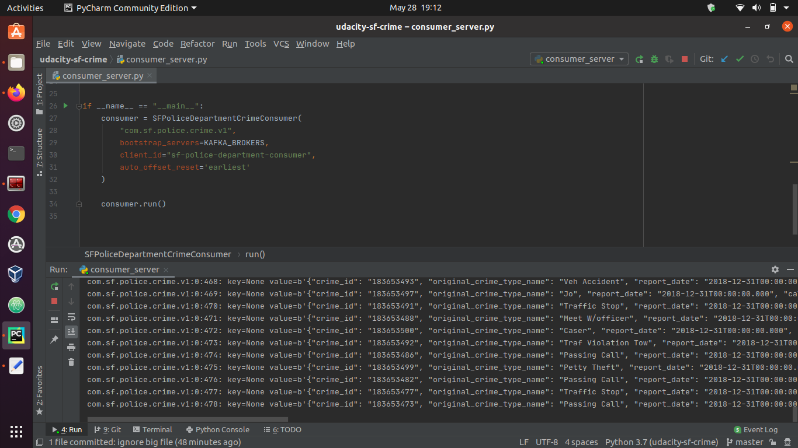
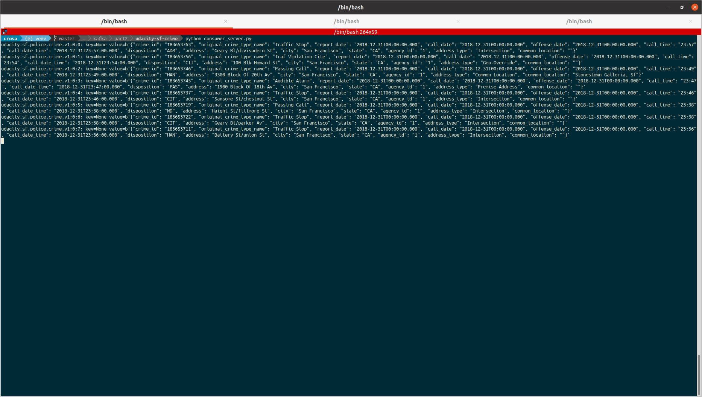
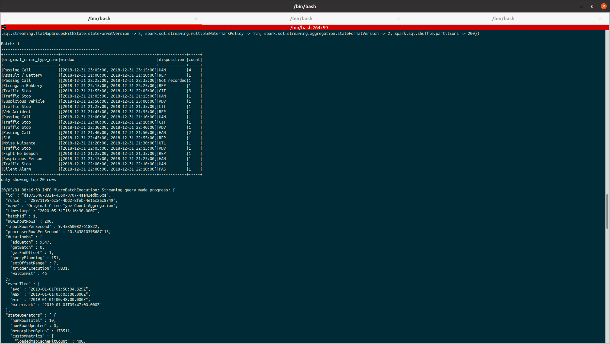
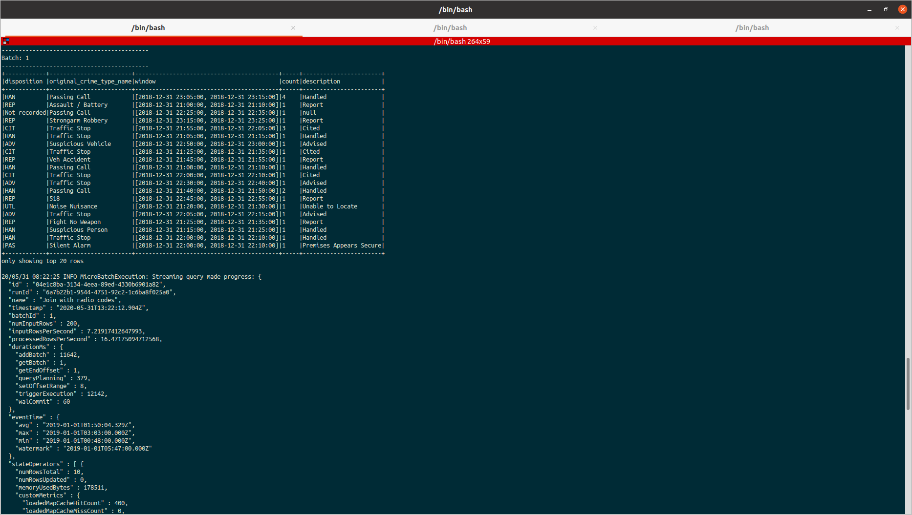
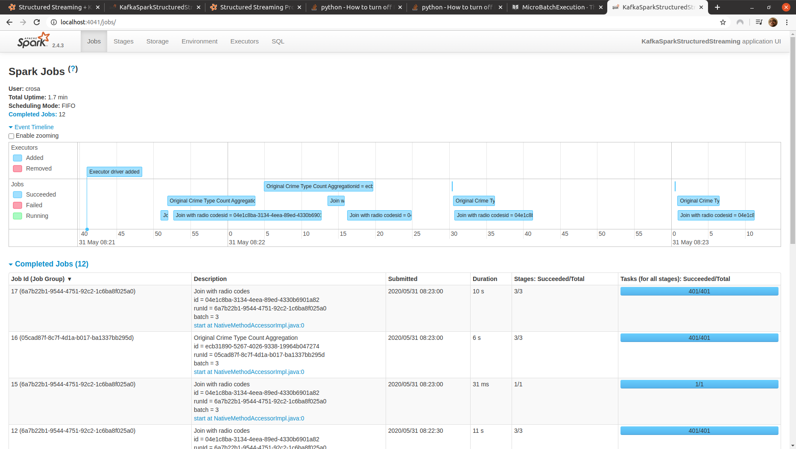
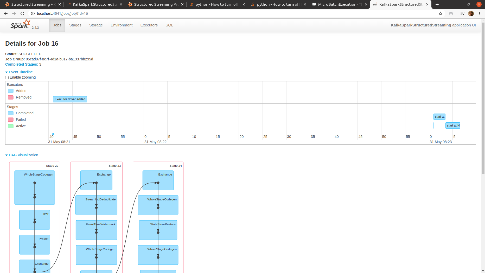

# SF Crime Statistics  with Spark Streaming

## Project Overview

In this project, you will be provided with a real-world dataset, extracted from Kaggle, on San Francisco crime incidents, and you will provide statistical analyses of the data using Apache Spark Structured Streaming. You will draw on the skills and knowledge you've learned in this course to create a Kafka server to produce data, and ingest data through Spark Structured Streaming.

## Development Environment

You may choose to create your project in the workspace we provide here, or if you wish to develop your project locally, you will need to set up your environment properly as described below:

    Spark 2.4.3
    Scala 2.11.x
    Java 1.8.x
    Kafka build with Scala 2.11.x
    Python 3.6.x or 3.7.x


## Step 1
* The first step is to build a simple Kafka server.
* Complete the code for the server in producer_server.py and kafka_server.py.

**Take a screenshot of your kafka-consumer-console output. You will need to include this screenshot as part of your project submission**

This is an image of the console consumer working on my dev environment (pycharm)



This is an image of the console consumer using the command line


## Step 2
* Apache Spark already has an integration with Kafka brokers, so we would not normally need a separate Kafka consumer. However, we are going to ask you to create one anyway. Why? We'd like you to create the consumer to demonstrate your understanding of creating a complete Kafka Module (producer and consumer) from scratch. In production, you might have to create a dummy producer or consumer to just test out your theory and this will be great practice for that.
* Implement all the TODO items in `data_stream.py`. You may need to explore the dataset beforehand using a Jupyter Notebook.
* Do a spark-submit using this command: 

`spark-submit --packages org.apache.spark:spark-sql-kafka-0-10_2.11:2.3.4 --master local[*] data_stream.py`
* Take a screenshot of your progress reporter after executing a Spark job. **You will need to include this screenshot as part of your project submission.**





* Take a screenshot of the Spark Streaming UI as the streaming continues. **You will need to include this screenshot as part of your project submission.**




## Step 3
Write the answers to these questions in the README.md doc of your GitHub repo:

### How did changing values on the SparkSession property parameters affect the throughput and latency of the data?
The way I have observed how the throughput changed was looking at the number of processed rows per second:
```
  "runId" : "05cad87f-8c7f-4d1a-b017-ba1337bb295d",
  "name" : "Original Crime Type Count Aggregation",
  "timestamp" : "2020-05-31T13:50:30.000Z",
  "batchId" : 58,
  "numInputRows" : 200,
  "inputRowsPerSecond" : 6.666666666666667,
  "processedRowsPerSecond" : 30.698388334612435,
```
TEST 1: Creating a topic with 10 partitions.
`kafka-topics --create --bootstrap-server localhost:9092 --replication-factor 1 --partitions 10  --topic udacity.sf.police.crime.v2`
Just changing the number of partitions on the kafka topic did not make a huge impact. So let's tune some other values.
```      "description" : "KafkaV2[Subscribe[udacity.sf.police.crime.v2]]",
    "startOffset" : {
      "udacity.sf.police.crime.v2" : {
        "8" : 140,
        "2" : 140,
        "5" : 140,
        "4" : 133,
        "7" : 140,
        "1" : 140,
        "9" : 133,
        "3" : 140,
        "6" : 133,
        "0" : 140
      }
    },
    "endOffset" : {
      "udacity.sf.police.crime.v2" : {
        "8" : 160,
        "2" : 160,
        "5" : 160,
        "4" : 152,
        "7" : 160,
        "1" : 160,
        "9" : 152,
        "3" : 160,
        "6" : 152,
        "0" : 160
      }
    },
    "numInputRows" : 197,
    "inputRowsPerSecond" : 6.566666666666666,
    "processedRowsPerSecond" : 34.27875413259092
```
TEST 2: Creating a topic with 10 partitions + spark.default.parallelism

I tried set parallelism to 10 but I did not get any changes either. I'm running it in a 4 cpu computer so that was kind of expected.

TEST 3:  parallelism=4, shuffle.partitions=10
Decreasing the number shuffle partitions to 10 increases the process rows per second considerabiliy from 40 to more than 100.
```    },
    "endOffset" : {
      "udacity.sf.police.crime.v2" : {
        "8" : 180,
        "2" : 180,
        "5" : 180,
        "4" : 171,
        "7" : 180,
        "1" : 180,
        "9" : 171,
        "3" : 180,
        "6" : 171,
        "0" : 180
      }
    },
    "numInputRows" : 197,
    "inputRowsPerSecond" : 6.566447785073831,
    "processedRowsPerSecond" : 102.39085239085239
  } ],
```
TEST 4: parallelism=4, shuffle.partitions=5
```  "sources" : [ {
    "description" : "KafkaV2[Subscribe[udacity.sf.police.crime.v2]]",
    "startOffset" : {
      "udacity.sf.police.crime.v2" : {
        "8" : 520,
        "2" : 520,
        "5" : 520,
        "4" : 494,
        "7" : 520,
        "1" : 520,
        "9" : 494,
        "3" : 520,
        "6" : 494,
        "0" : 520
      }
    },
    "endOffset" : {
      "udacity.sf.police.crime.v2" : {
        "8" : 540,
        "2" : 540,
        "5" : 540,
        "4" : 513,
        "7" : 540,
        "1" : 540,
        "9" : 513,
        "3" : 540,
        "6" : 513,
        "0" : 540
      }
    },
    "numInputRows" : 197,
    "inputRowsPerSecond" : 6.566666666666666,
    "processedRowsPerSecond" : 182.74582560296844
```

TEST 5: parallelism=4, shuffle.partitions=1
it slows down.


### What were the 2-3 most efficient SparkSession property key/value pairs? Through testing multiple variations on values, how can you tell these were the most optimal?
By default we started with 1 partition in our kafka topic so one of the things we can do to increase throughput is to increase the number of partitions so we can have 
more consumers reading data in parallel.


### References
* https://kafka-python.readthedocs.io/en/master/usage.html
* https://spark.apache.org/docs/latest/sql-performance-tuning.html
* https://spark.apache.org/docs/2.2.0/structured-streaming-kafka-integration.html
* https://databricks.com/blog/2017/05/08/event-time-aggregation-watermarking-apache-sparks-structured-streaming.html
* https://luminousmen.com/post/introduction-to-pyspark-join-types